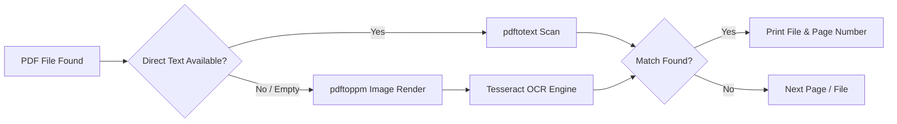

# 🔍 `pdf_search`

> **Fast, recursive PDF search tool written in C with automatic OCR fallback for scanned documents.**


---

## ⚡ Quick One-Line Installation

> [!IMPORTANT]
> **Get started in seconds!** Run the one-line automated installer in your terminal to automatically resolve system dependencies, compile `pdf_search`, and install it system-wide:

```bash
curl -sSL https://raw.githubusercontent.com/cjoy72/pdf_search/main/install_pdf_search.sh | bash
```

---

## ✨ Key Features

- ⚡ **Fast Direct Extraction**: Uses `pdftotext` for ultra-fast text search on standard vector PDFs.
- 👁️ **Smart OCR Fallback**: Automatically detects scanned/image-only PDF pages, renders them (`pdftoppm`), and runs Optical Character Recognition via `tesseract`.
- 📂 **Recursive Directory Search**: Recursively traverses deep directory structures to search across all `.pdf` and `.PDF` files.
- 📦 **Auto-Dependency Resolution**: Automatically detects and installs required OS packages (`poppler`, `tesseract`, etc.) during setup.
- 🌐 **System-Wide Availability**: Installs directly to `/usr/local/bin` so you can search from any terminal directory.

---

## 🚀 Usage

Since `pdf_search` is installed system-wide, run it directly from any directory:

```bash
pdf_search <search-term> [folder-path]
```

### Examples

**Search current directory:**
```bash
pdf_search MINCHIA
```

**Search a specific folder:**
```bash
pdf_search "invoice number" ~/Documents/Invoices
```

### 📋 Example Output

```text
./documents/report.pdf -> page 3
./scanned/receipt_2024.pdf -> page 1 (OCR)
./archive/tax_return.pdf -> page 12
```

---

## 🛠️ How It Works



---

## 📦 Installation Options

### Option 1: Automated One-Liner (Recommended)

Highlighting the hassle-free installation command:

```bash
curl -sSL https://raw.githubusercontent.com/cjoy72/pdf_search/main/install_pdf_search.sh | bash
```

**What `install_pdf_search.sh` handles automatically:**
1. **OS Compatibility Verification**: Checks for supported macOS or Linux (Debian/Ubuntu/Fedora/Arch) environments.
2. **Dependency Setup**: Runs `make`, which automatically installs `poppler-utils`, `tesseract`, and language packs via your system package manager (`brew`, `apt`, `dnf`, or `pacman`).
3. **Compilation & Global Install**: Compiles C source files into `pdf_search` and installs it to `/usr/local/bin`.
4. **Automatic Cleanup**: Deletes temporary git files and build artifacts upon completion.

---

### Option 2: Manual Clone & Build

If you prefer to clone and build manually:

```bash
# 1. Clone the repository
git clone https://github.com/cjoy72/pdf_search.git
cd pdf_search

# 2. Build and install system-wide
make
```

---

## 🧩 Dependencies Breakdown

| Component | Dependency | Description | Package Name |
| :--- | :--- | :--- | :--- |
| **Compiler** | `gcc` / `clang` | C99 supported C compiler | `build-essential` / `Xcode CLI` |
| **Build System**| `make` | GNU Make build automation | `make` |
| **Text Extraction**| `pdftotext` / `pdfinfo` | Extracts text streams & info from PDFs | `poppler` / `poppler-utils` |
| **Page Rendering** | `pdftoppm` | Converts scanned pages to PNG for OCR | `poppler` / `poppler-utils` |
| **OCR Engine** | `tesseract` | Optical character recognition | `tesseract` / `tesseract-ocr` |
| **OCR Datasets** | `tesseract-lang` | Multi-language trained OCR datasets | `tesseract-lang` / `tesseract-ocr-all` |

### Manual Package Pre-Installation

If you prefer to install dependencies manually before building:

- **macOS (Homebrew):**
  ```bash
  brew install poppler tesseract tesseract-lang
  ```

- **Ubuntu / Debian:**
  ```bash
  sudo apt-get update
  sudo apt-get install -y build-essential poppler-utils tesseract-ocr tesseract-ocr-all
  ```

- **Fedora / RHEL:**
  ```bash
  sudo dnf install -y poppler-utils tesseract tesseract-langpack-en
  ```

- **Arch Linux:**
  ```bash
  sudo pacman -Sy --noconfirm poppler tesseract tesseract-data-eng
  ```

---

## 🧹 Maintenance & Uninstallation

**To uninstall `pdf_search` from `/usr/local/bin`:**
```bash
make uninstall
```

**To clean local build artifacts:**
```bash
make clean
```
